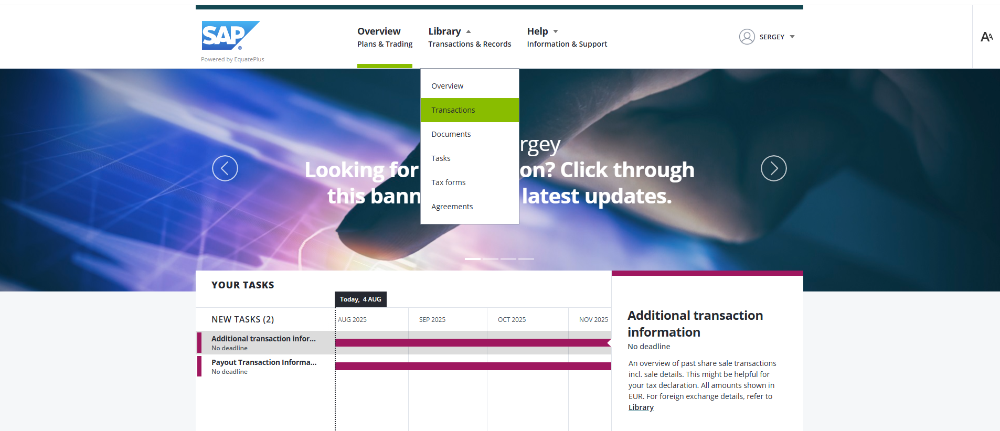
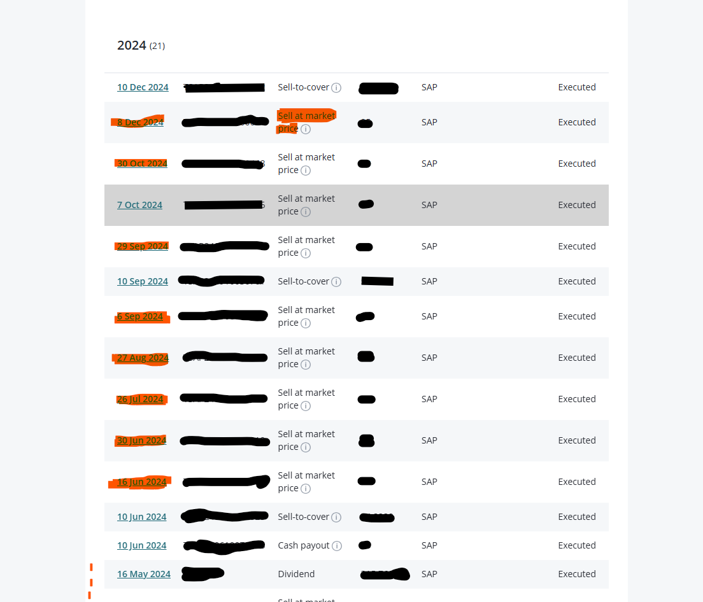
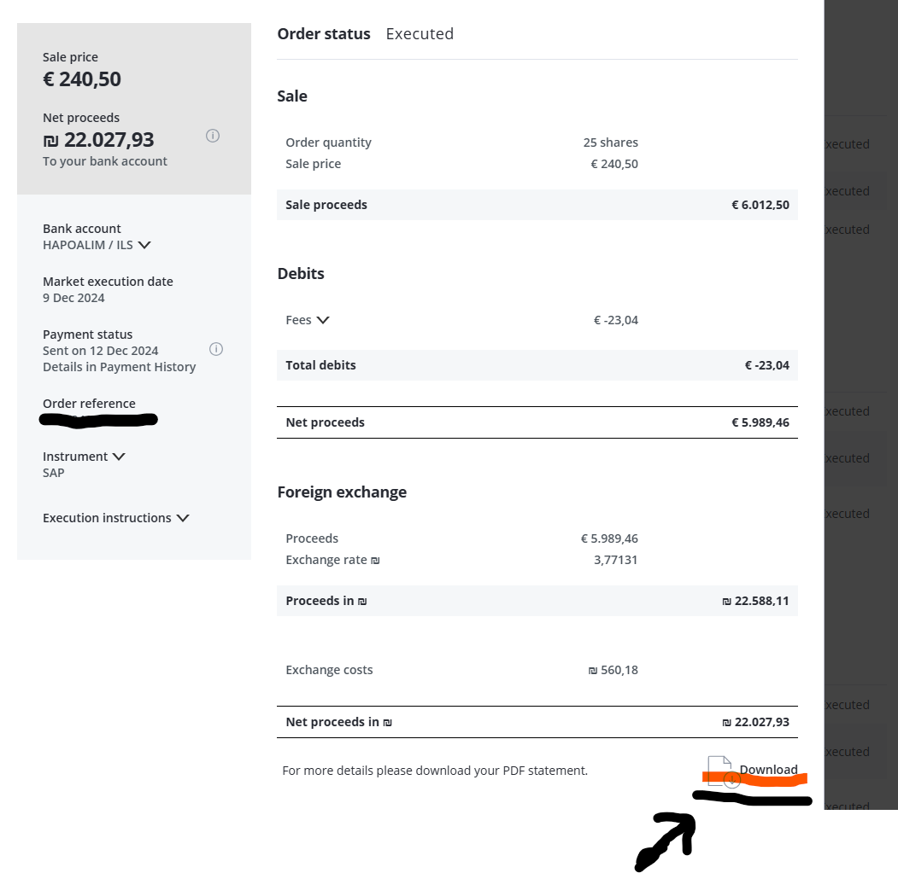
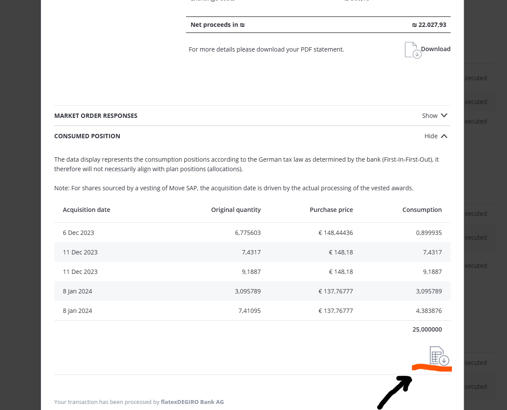
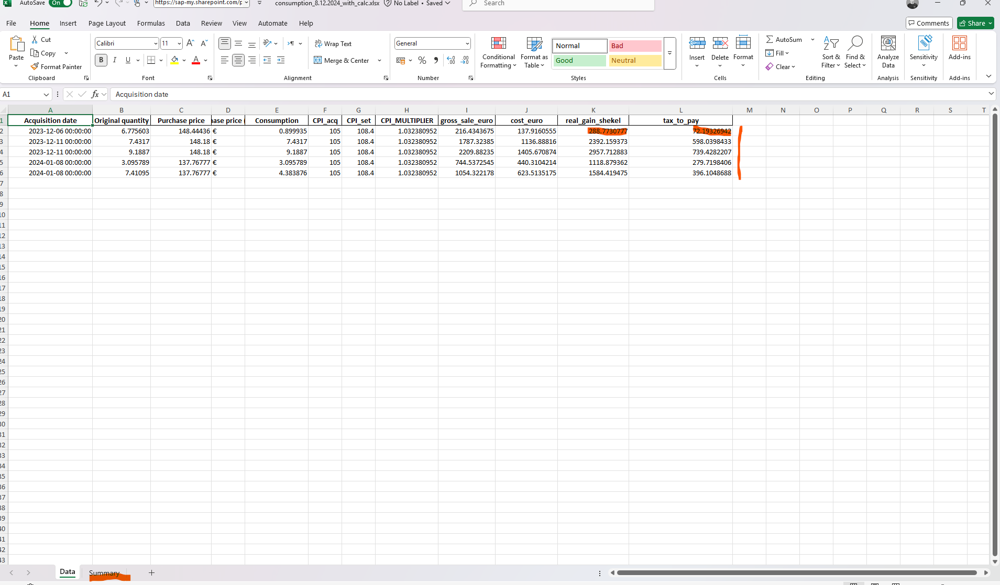
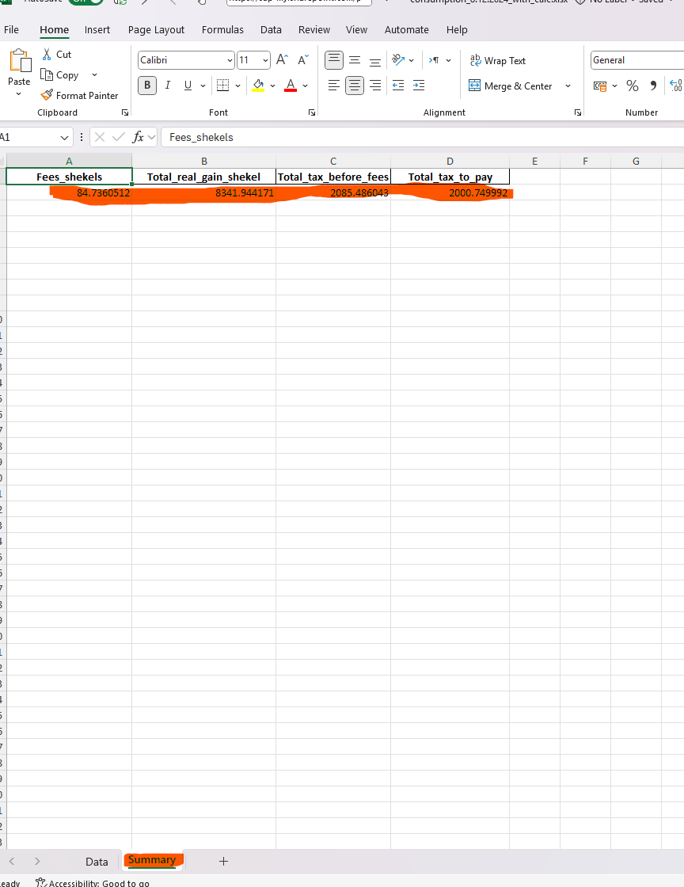

# File Requirements for Tax Calculator

## Required File Pairs

The script expects matching pairs of files for each stock sale:
- `sale_<date>.pdf` - PDF document containing sale details
- `consumption_<date>.csv` - CSV file with consumption data for the same date

**Example:** `sale_8.12.2024.pdf` + `consumption_8.12.2024.csv`

[How to obtain these files from Equate website](#obtaining-files-from-equate)

## File Location

All files must be placed in the **repository root directory** when running the script.

## Timing Recommendations

**Best practice:** Collect file pairs for the previous tax year after the Consumer Price Index (CPI) for all sales has been updated, but before the Israeli tax authority deadline:

- **Simple returns:** By April 30 of the following year
- **Full returns:** By May 31 of the following year (or later with extension)

## What the Script Calculates

For each file pair, the script calculates:
- Real gain in shekels, adjusted for CPI inflation
- Tax amount owed for that specific sale

This ensures accurate tax reporting with proper inflation adjustments according to Israeli tax regulations.

## Obtaining Files from Equate

1. Go to EquatePlus website, there select Library -> Transactions:

2. open the relevant year, and from there for every sale transaction:
 
we need 2 files: 
(make sure to only include the "Sell at market price" entries) 
the sale summary:

save this under sale_D.M.YYYY.pdf 
 (ex. sale_8.12.2024.pdf) 
and the consumption details (cost basis):

save this under consumption_D_M_YYYY.csv  (ex consumption_8.12.2024.csv) 
note that those files are matched and paired by the date, so we need 2 files for every date(sale)
3. copy the pair files for every sale into the repo root folder
4. run the script `python tax_calculator.py`
5. for every sale (pair) a new file will be generated: 
consumption_8.12.2024_with_calc.xlsx

containing the calculated fields.

The document will contain the real shekel gain for every batch of shares sold, and corresponding tax:

and in the summary tab below the total real shekel gain and the tax owed (with deduction of equate plus fees) for this specific sale:

which can be used to easily submit yearly tax report to israel tax authority at the beginning of the following year, before the deadline set by the tax authority:

- By April 30 of the following year if not required to file a full return
- If required to file — by May 31, or later with extension
